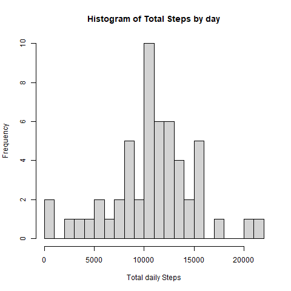
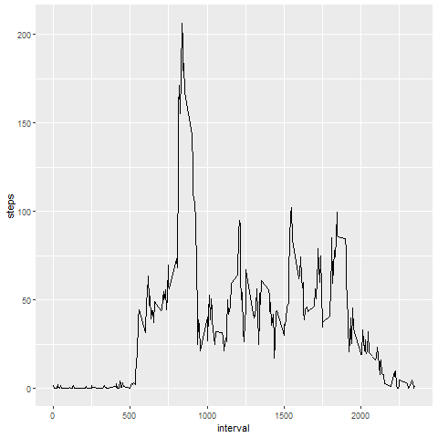
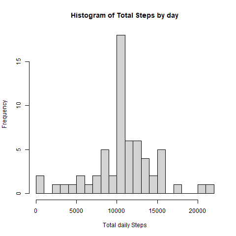
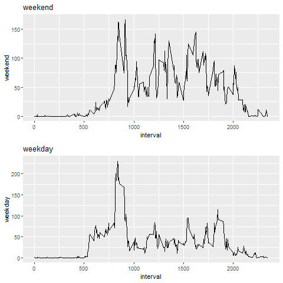

 


### Introduction

This is the first assignment in the Coursera course "Reproducible Research", taught by the Johns Hopkins University.

By using the data and the instructions provided y the assignment's website, the basic principles  behind reproducible research will be put into action.

In order to complete the tasks, the following packages will be used:


```r
library(dplyr)
library(reshape2)
library(ggplot2)
library(gridExtra)
```

### Loading and preprocessing the data

The second step includes setting the working directory to the source file location and loading the data.


```r
setwd(dirname(rstudioapi::getActiveDocumentContext()$path))

download.file("https://d396qusza40orc.cloudfront.net/repdata%2Fdata%2Factivity.zip", destfile = "activity.zip", mode="wb")

unzip("activity.zip")
data <- read.csv("activity.csv", header = TRUE)
```

The questions provided in the assignment will be answered in the following sections.


### What is mean total number of steps taken per day?

1. Calculate the total number of steps taken per day.


```r
databydate <- data %>% select(date, steps) %>% group_by(date) %>% summarize(tsteps= sum(steps)) %>% na.omit()

databydate
```

```
## # A tibble: 53 x 2
##    date       tsteps
##    <chr>       <int>
##  1 2012-10-02    126
##  2 2012-10-03  11352
##  3 2012-10-04  12116
##  4 2012-10-05  13294
##  5 2012-10-06  15420
##  6 2012-10-07  11015
##  7 2012-10-09  12811
##  8 2012-10-10   9900
##  9 2012-10-11  10304
## 10 2012-10-12  17382
## # ... with 43 more rows
```

2. Make a histogram of the total number of steps taken each day.


```r
png(file="figure\\1_totalNumberStepsDaily.png")

hist(databydate$tsteps, xlab = "Total daily Steps",main="Histogram of Total Steps by day", breaks = 20)

dev.off()
```

 

3. Calculate and report the mean and median of the total number of steps taken per day.


```r
mean(databydate$tsteps)
```

```
## [1] 10766.19
```

```r
median(databydate$tsteps)
```

```
## [1] 10765
```


### What is the average daily activity pattern?

1. Make a time series plot of the 5-minute interval (x-axis) and the average number of steps taken, averaged across all days (y-axis)


```r
data_timePlot <- dcast(data, date ~ interval , value.var = "steps")
data_timePlot <- lapply(data_timePlot[2:ncol(data_timePlot)], mean, na.rm=TRUE)
data_timePlot <- data.frame(data_timePlot)
data_timePlot <- t(data_timePlot)
data_timePlot <- data.frame(cbind(unique(data$interval), data_timePlot))
colnames(data_timePlot) <- c("interval", "steps")
png(file="figure\\2_averageSteps5minInterval.png")
ggplot(data=data_timePlot, aes(x=interval, y=steps)) + geom_line()
dev.off()
```

 

2. Which 5-minute interval, on average across all the days in the dataset, contains the maximum number of steps?


```r
data_timePlot[rev(order(data_timePlot$steps)),][1,1]
```

```
## [1] 835
```


## Imputing missing values.


1. Calculate and report the total number of missing values in the dataset. 


```r
sum(is.na(data$steps))
```

```
## [1] 2304
```


2. Devise a strategy for filling in all of the missing values in the dataset. In this case, I have filled in the NA data with the mean for each 5 minute interval.


```r
data_imputedNA <- dcast(data, date ~ interval , value.var = "steps")


for (column in c(2:ncol(data_imputedNA)))
{
  for (row in c(1:nrow(data_imputedNA)))
  {
    if( is.na(data_imputedNA[row, column]) ) {
      
      data_imputedNA[row, column] = lapply(data_imputedNA[column], mean, na.rm = TRUE)

    }
  }
}
```

3. Create a new dataset that is equal to the original dataset but with the missing data filled in. 


```r
data_timePlotFilled <- melt(data_imputedNA) 

data_timePlotFilled <- data_timePlotFilled[order(data_timePlotFilled$date),]

colnames(data_timePlotFilled) <- c("date", "interval", "steps")

data_timePlotFilled <- cbind(data_timePlotFilled$steps, data_timePlotFilled[1:2])

colnames(data_timePlotFilled) <- c("steps", "date", "interval")
```


4. Make a histogram of the total number of steps taken each day and Calculate and report the mean and median total number of steps taken per day. 


```r
databydateFilled <- data_timePlotFilled %>% select(date, steps) %>% group_by(date) %>% summarize(tsteps= sum(steps)) %>%na.omit()


png(file="figure\\3_totalNumberStepsDaily_Filled.png")

hist(databydateFilled$tsteps, xlab = "Total daily Steps",main="Histogram of Total Steps by day", breaks = 20)

dev.off()
```



```r
mean(databydateFilled$tsteps)
```

```
## [1] 10766.19
```

```r
median(databydateFilled$tsteps)
```

```
## [1] 10766.19
```


## Are there differences in activity patterns between weekdays and weekends?

1. Create a new factor variable in the dataset with two levels – “weekday” and “weekend” indicating whether a given date is a weekday or weekend day.


```r
data_timePlotFilled$day <- weekdays( as.Date(data_timePlotFilled$date, format = "%Y-%m-%d") )

for( row in c(1:nrow(data_timePlotFilled)) ){
  
  if(data_timePlotFilled$day[row] %in% c("lunes","martes","miércoles","jueves", "viernes")){
    
    data_timePlotFilled$day[row] = "weekday"
    
  } else {
    
    data_timePlotFilled$day[row] = "weekend"
  
  }
}

data_timePlot_week <- dcast(data_timePlotFilled, day ~ interval , value.var = "steps", fun.aggregate = mean)

data_timePlot_week <- data.frame( t(data_timePlot_week) )

data_timePlot_week <- data_timePlot_week[2:nrow(data_timePlot_week),1:2]

data_timePlot_week <- cbind(unique(data_timePlotFilled$interval), data_timePlot_week)

colnames(data_timePlot_week) <- c("interval", "weekday", "weekend")

data_timePlot_week$interval <- unique(data$interval)

data_timePlot_week$weekday <- as.numeric(data_timePlot_week$weekday)

data_timePlot_week$weekend <- as.numeric(data_timePlot_week$weekend)
```


2. Make a panel plot containing a time series plot of the 5-minute interval (x-axis) and the average number of steps taken, averaged across all weekday days or weekend days (y-axis).


```r
p1 <- ggplot(data=data_timePlot_week, aes(x=interval, y=weekend)) + geom_line() + ggtitle("weekend")

p2 <- ggplot(data=data_timePlot_week, aes(x=interval, y=weekday)) + geom_line() + ggtitle("weekday")


png(file="figure\\4_averageSteps5minInterval_week.png") 

grid.arrange(p1, p2, nrow = 2) 
 
dev.off()
```


